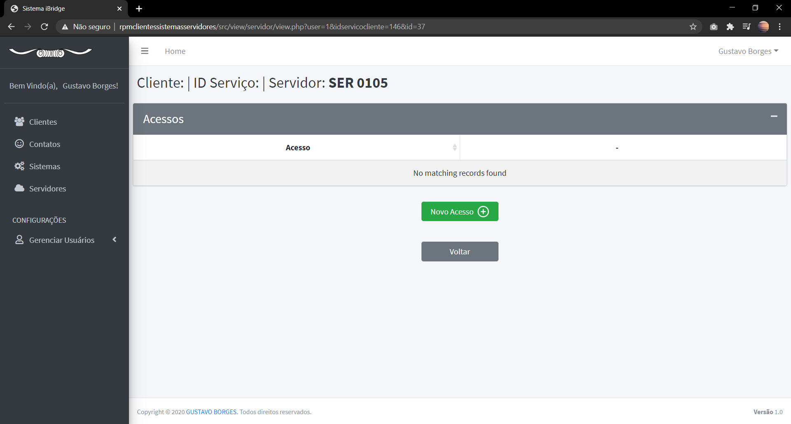
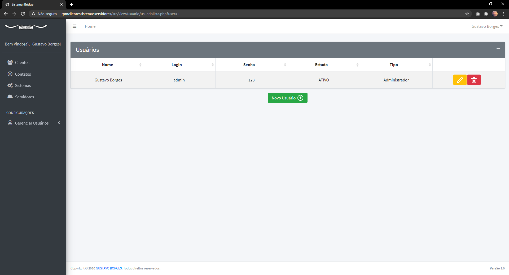
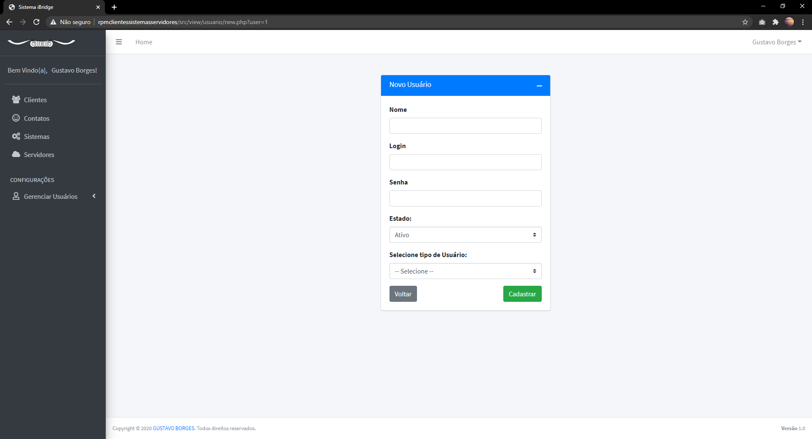
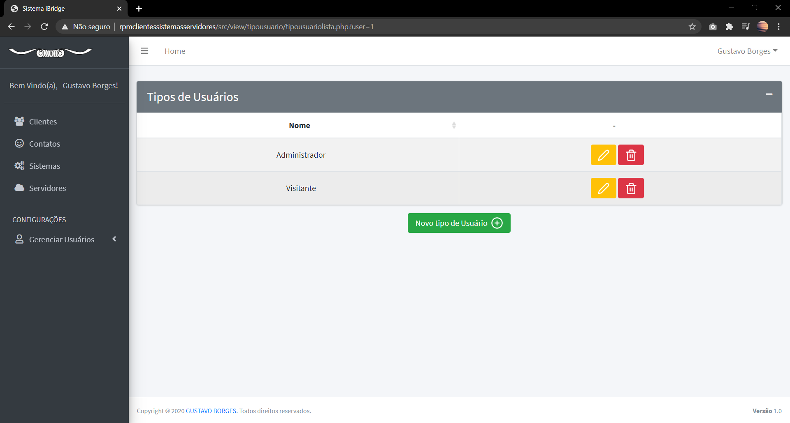
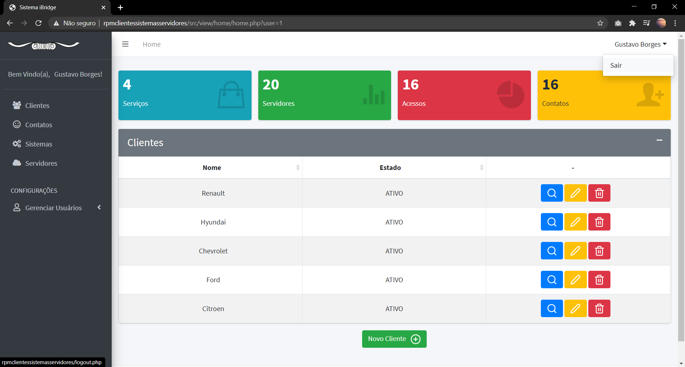

# SistemaRpmClientes-Servidores
Sistema completo de controle do registro de clientes, sistemas, servidores, contatos e usuários. Desenvolvido utilizando PHP no backend, Javascript, css e html5 no frontend, e com a template AdminLTE3. Foi elaborado o diagrama de classes conforme os requisitos e o sistema foi construído a partir deste.

GUIA:

TELA DE LOGIN:

PÁGINA HOME - DASHBOARD; PAINEL DE CLIENTES COM CRUD;

 
 

PÁGINA CONTATOS

 
 
NOVO CONTATO

PÁGINA SISTEMAS

 
 
NOVO SISTEMA

PÁGINA SERVIDORES

 
 
PÁGINA NOVO SERVIDOR

PÁGINA DO CLIENTE

NOVO SERVIÇO PARA O CLIENTE

 
 
PÁGINA DO SERVICO DO CLIENTE COM CADASTRO DE SERVIDORES

 
PÁGINA DE ACESSOS DO SERVIDOR DO SERVIÇO DO CLIENTE

NOVO CONTATO PARA O CLIENTE

 
 
PÁGINA DO CONTATO COM CADASTRO DE TELEFONES

USUÁRIOS DO SISTEMA

 
 
NOVO USUÁRIO

 
 
TIPOS DE USUÁRIO

LOGOFF

