# SistemaRpmClientes-Servidores
Sistema completo de controle de clientes, sistemas, servidores, contatos e usuários. Desenvolvido para empresa, utilizando php puro com a template AdminLTE3. Sistema modificado para publicaçãoOpen Source.

GUIA:

TELA DE LOGIN:
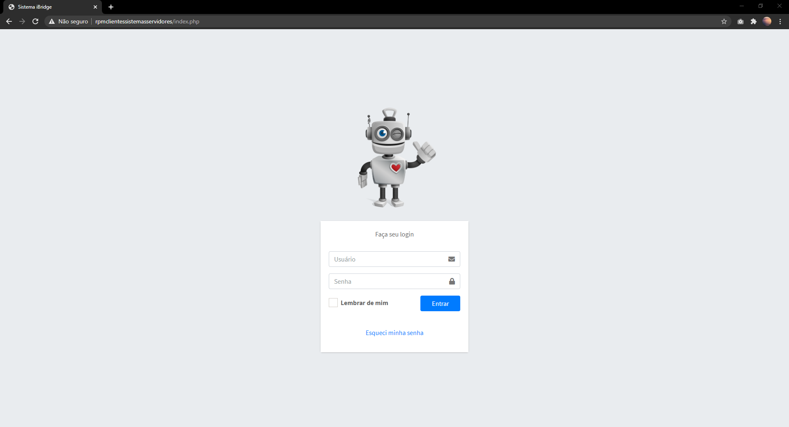

PÁGINA HOME - DASHBOARD; PAINEL DE CLIENTES COM CRUD;
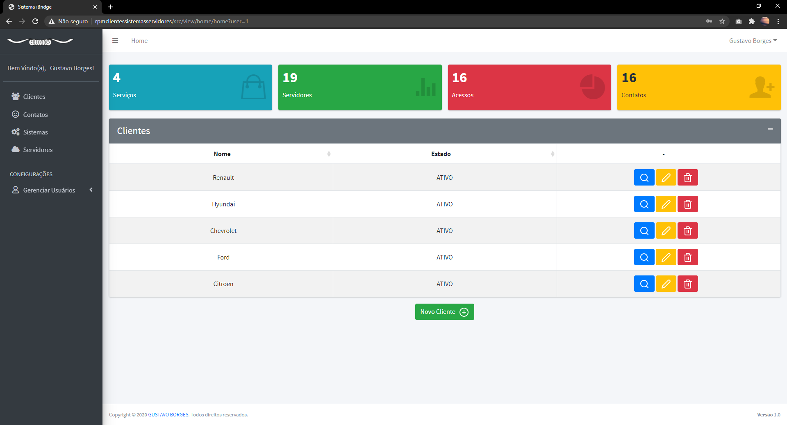
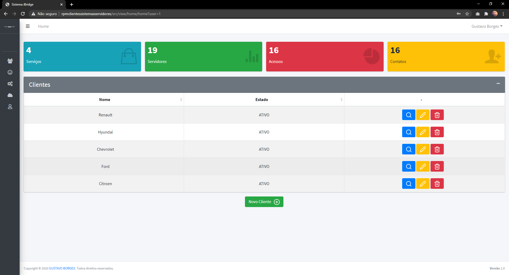

PÁGINA CONTATOS
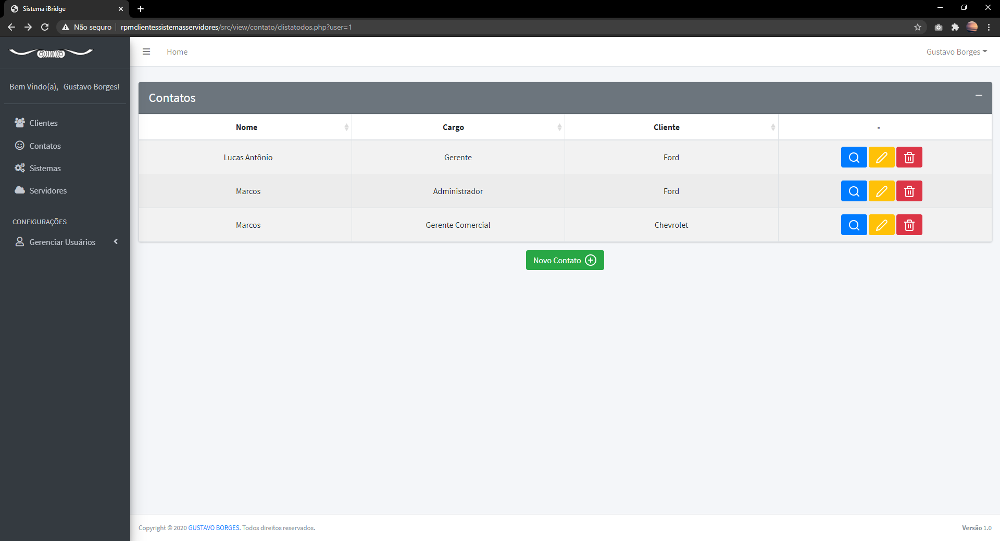
 
NOVO CONTATO
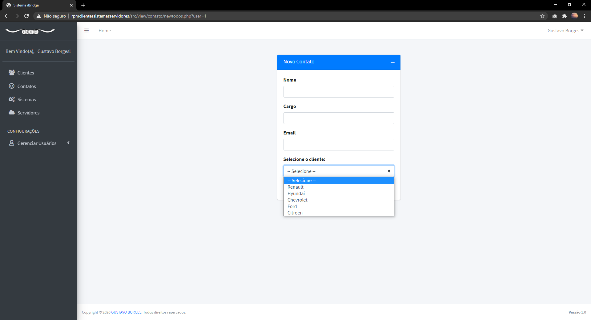

PÁGINA SISTEMAS
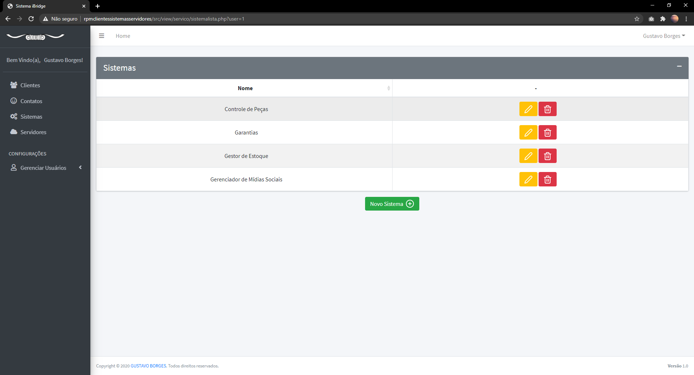
NOVO SISTEMA
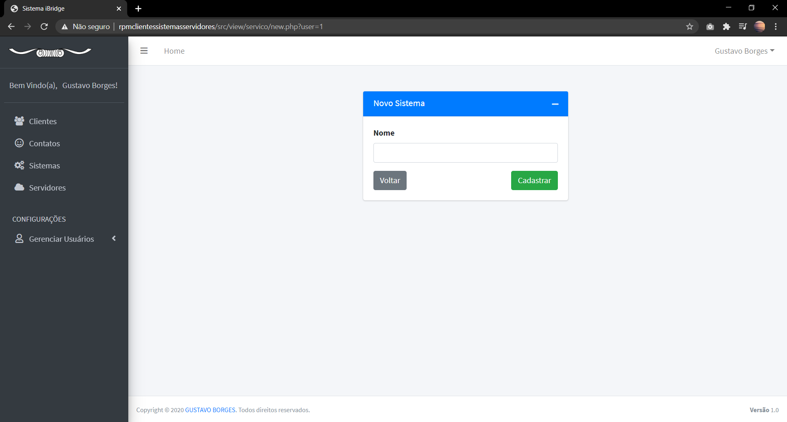

PÁGINA SERVIDORES
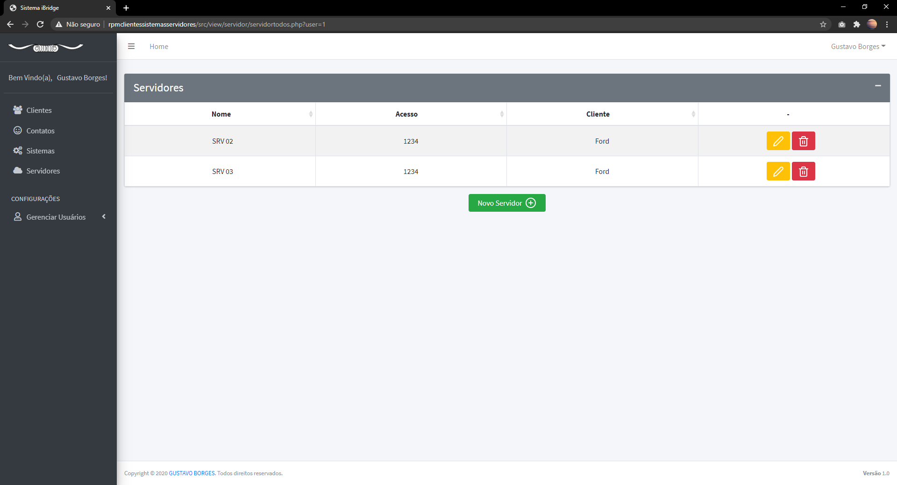
 
PÁGINA NOVO SERVIDOR
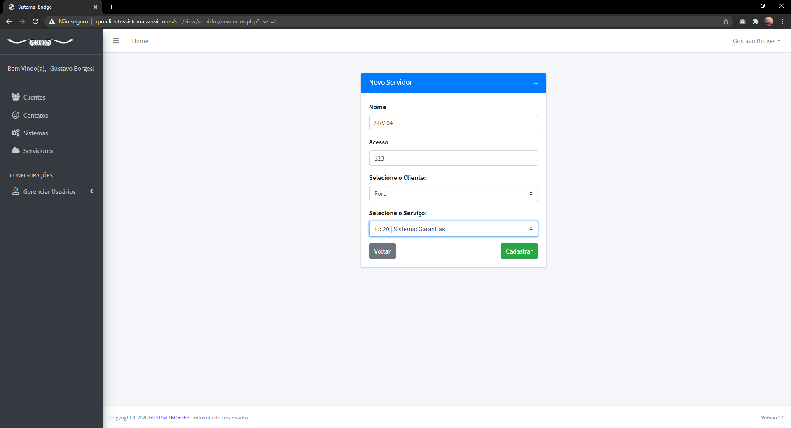

PÁGINA DO CLIENTE
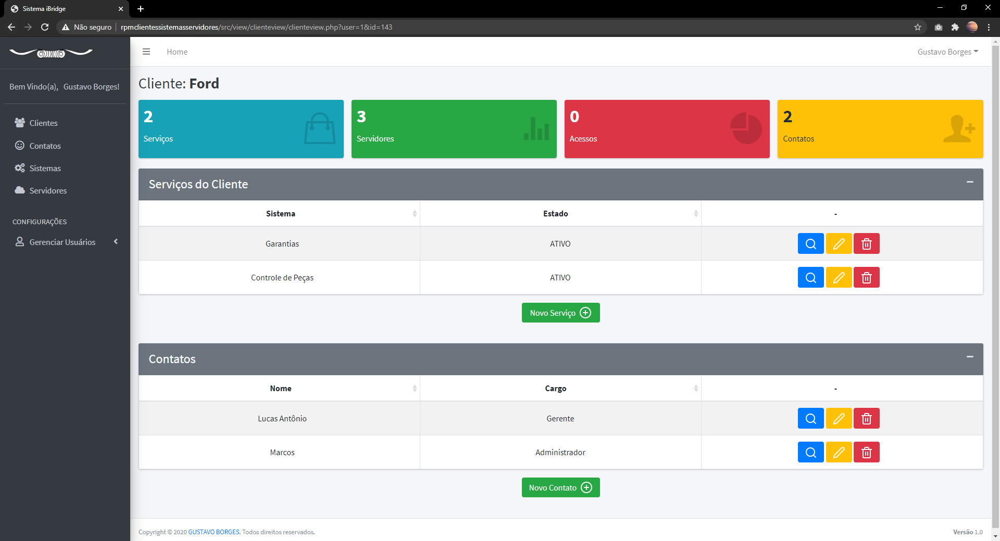

NOVO SERVIÇO PARA O CLIENTE
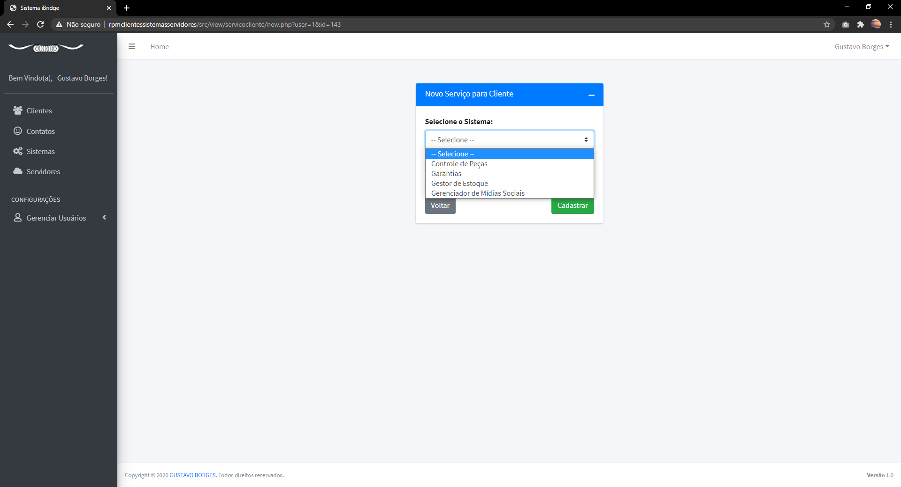
 
PÁGINA DO SERVICO DO CLIENTE
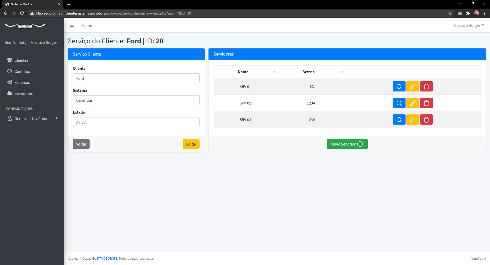

NOVO CONTATO PARA O CLIENTE
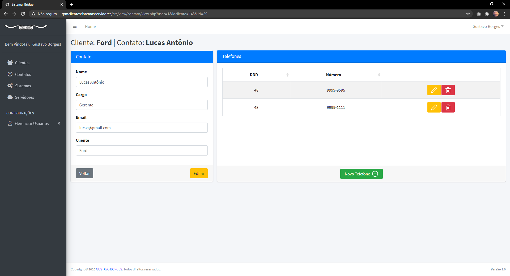
 
PÁGINA DO CONTATO COM CADASTRO DE TELEFONES

USUÁRIOS DO SISTEMA

 
NOVO USUÁRIO
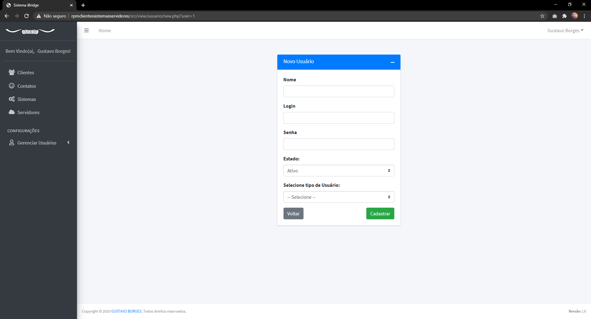

